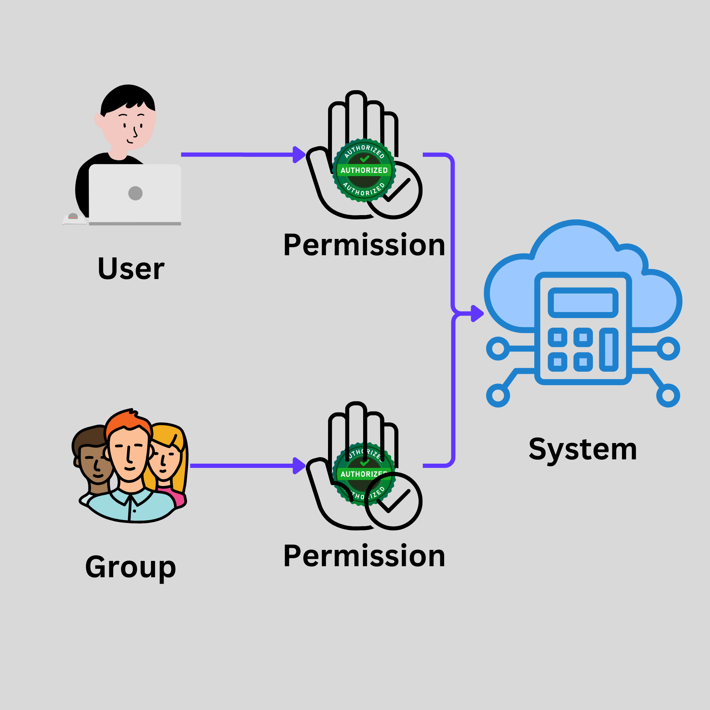

# Understanding AWS IAM

Every system typically incorporates mechanisms for **authentication** and **authorization**:

- **Authentication** verifies if an individual or entity is part of the system.
- **Authorization** determines whether an individual or entity has access to specific resources within the system.

IAM is not exclusive to AWS; it's a universal concept applicable across various systems and organizations, focusing on managing access and permissions effectively. The main components of IAM include:

## Components

### User

- Represents either a human user or a system/service account within the system.

### Group

- A collection of users sharing similar roles, responsibilities, or permissions, facilitating easier management of access rights.

### Permissions

- Defines what actions a user or group is allowed to perform, typically outlined in a policy document.

### Resource

- The assets or services within the system, such as EC2, S3, IAM, etc., that users or groups interact with. Resources are generally represented as nouns.

### Action

- The operations that can be performed on resources, essentially the "verbs" of IAM, including:
  - **Get**: To retrieve or view resources.
  - **Create**: To generate new instances of resources.
  - **Update**: To modify existing resources.
  - **Delete**: To remove resources from the system.

Permissions in IAM are usually encapsulated within policy documents that list allowable actions on specified resources. These documents can be attached to users or groups, granting them the defined capabilities.

This framework ensures that entities within the system are authenticated and authorized appropriately, maintaining security and operational integrity.
