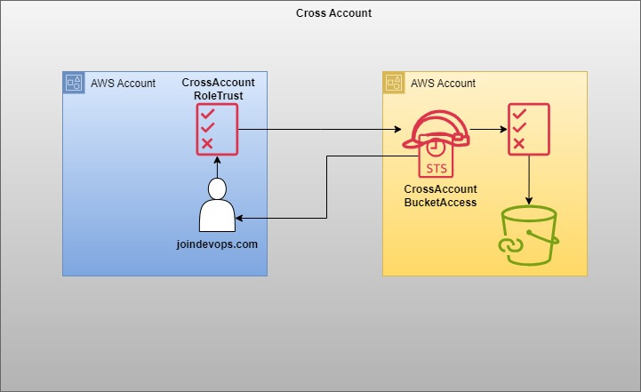

# IAM Role

* IAM Roles have certain permissions defined for making AWS service requests.
* IAM roles are not directly associated with a specific user or group.
* They are intended to be assumable by anyone who needs them.
* IAM role can be assumed by an AWS service, an application, or an authenticated user, granting them temporary security credentials to make AWS API calls.

Our AMI Details
* Name: devops-practice
* username: centos
* password: DevOps321
* Security Group: create a SG that allows port 22 at least to connect.

# Use case-1
* Create a role for EC2
* List All buckets
* List objects inside a specific bucket.

# Use case-2
* Create a role for EC2
* It can create EC2 instances.
* It can create/update records in Route53.

```
{
    "Version": "2012-10-17",
    "Statement": [
        {
            "Effect": "Allow",
            "Action": [
                "ec2:RunInstances",
                "ec2:DescribeInstances",
                "ec2:CreateTags"
            ],
            "Resource": "*"
        },
        {
            "Effect": "Allow",
            "Action": [
                "route53:ChangeResourceRecordSets",
                "route53:ListHostedZones",
                "route53:GetHostedZone",
                "route53:ListResourceRecordSets"
            ],
            "Resource": "*"
        }
    ]
}
```

# How a user can assume Role.

What are the advantages of user assuming role instead of directly giving permissions to him?

* When users assume role, it will give temporary credentials with time out of 15min, these keys will be auto rotated by AWS.
* Direct permissions keys will have long term validity and manual rotation.
* Cross account access can be easily managed by roles.
* When a user assumes a role, the action is logged in AWS CloudTrail, providing clear audit.

# Use case-3
* Create a role that have the permission of full EC2 access in us-east-1 region.
```
{
    "Version": "2012-10-17",
    "Statement": [ 
        {
            "Effect": "Allow", 
            "Action": "ec2:*", 
            "Resource": "*", 
            "Condition": { 
                "StringEquals": {
                    "ec2:Region": "us-east-1"
                }
            }
        }
    ]
}
```
* A user joindevops.com can have trust relationship with it.
* User joindevops.com should have a permission to assume the role.
* User has to run a sts command to assume the role.
```
aws sts assume-role \
  --role-arn "arn:aws:iam::ACCOUNT_ID:role/ROLE_NAME" \
  --role-session-name SESSION_NAME
```
* export the keys and token came as out of the previous command.
```
export AWS_ACCESS_KEY_ID="AccessKeyId"
export AWS_SECRET_ACCESS_KEY="SecretAccessKey"
export AWS_SESSION_TOKEN="SessionToken"
```

# Use case-4

How to give cross account access for a user?

* There are 2 accounts.
* Account-1 belongs to our company. Account-2 belongs to third party.
* There is a bucket in our company account for which third party user needs access.

How to achieve this?
* Create a Role in our company account.
* This role should have permissions to access the bucket.
* This role should have trust relationship with the user in third party account.
* User in third party account should have a permission to assume role in our company account.

